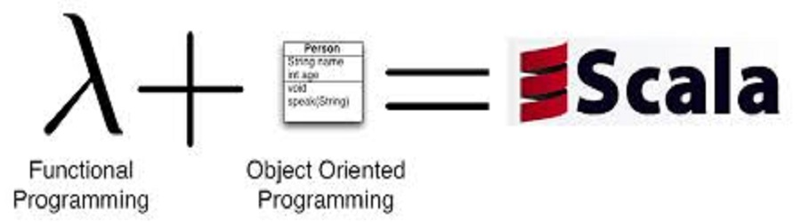

>A collection of materials to learn Scala

###Who is using Scala

[Scala in the Enterprise](http://www.scala-lang.org/old/node/1658)

[What startups or tech companies are using Scala?](http://www.quora.com/What-startups-or-tech-companies-are-using-Scala)
 
[Who's using Scala?](http://alvinalexander.com/scala/whos-using-scala-akka-play-framework)

###Start

Download the latest [Scala version](http://www.scala-lang.org/download/).

Use a text editor such as [Sublime Text](https://www.sublimetext.com/), [Vim](http://www.vim.org/) or [Emacs](http://www.gnu.org/software/emacs/) 

If you want to write a large scala project, you may need some tools such as [SBT](http://www.scala-sbt.org/), the [Scala IDE](http://scala-ide.org/?_ga=1.269024689.1997628608.1417240943), 
[IntelliK IDEA with the Scala plugin](http://www.jetbrains.com/idea/) or [NetBeans IDE with the scala plugin](https://netbeans.org/). 

###MOOC

[Functional Programming Principles in Scala](https://www.coursera.org/course/progfun) taught by Martin Odersky. A very good course covers 
scala basic, functions, recursion, immutable objects, inheritance, types & pattern matching, lists, collections & combinatorial search and lazy evaluation.

[Principles of Reactive Programming](https://www.coursera.org/course/reactive) taught by Martin Odersky, Erik Meijer and Roland Kuhn. A following course covers 
functional programming & mutable state, futures & monad, reactive stream processing, actors, supervision and conversiona patterns.

###Book

[Scala for the Impatient](http://www.amazon.com/gp/product/0321774094/ref=as_li_ss_il?ie=UTF8&camp=1789&creative=390957&creativeASIN=0321774094&linkCode=as2&tag=bionicspirit-20)

[Programming in Scala](http://www.amazon.com/Programming-Scala-Comprehensive-Step-Step/dp/0981531644/ref=pd_sim_b_1?ie=UTF8&refRID=1ABW4PNG8NPWP68Q9YXG)

[Scala Cookbook](http://www.amazon.com/Scala-Cookbook-Object-Oriented-Functional-Programming/dp/1449339611/ref=pd_sim_b_2?ie=UTF8&refRID=1ABW4PNG8NPWP68Q9YXG)

[Scala in Depth](http://www.amazon.com/Scala-Depth-Joshua-D-Suereth/dp/1935182706/ref=pd_sim_b_3?ie=UTF8&refRID=1ABW4PNG8NPWP68Q9YXG)

[Scala in Action](http://www.amazon.com/Scala-Action-Nilanjan-Raychaudhuri/dp/1935182757/ref=sr_1_1?s=books&ie=UTF8&qid=1418273002&sr=1-1&keywords=scala+in+action)

[Functional Programming in Scala](http://www.amazon.com/Functional-Programming-Scala-Paul-Chiusano/dp/1617290653/ref=pd_sim_b_5?ie=UTF8&refRID=1ABW4PNG8NPWP68Q9YXG)

###Tutorial

[Scala Tour](http://scalatutorials.com/tour/)

[Twitter Scala School](http://twitter.github.io/scala_school/)

[A Tour of Scala ](http://docs.scala-lang.org/tutorials/?_ga=1.105494339.1997628608.1417240943)

[The Neophyte's Guide to Scala](http://danielwestheide.com/scala/neophytes.html)

[Effective Scala](http://twitter.github.io/effectivescala/index.html)

[Scalacheat](http://docs.scala-lang.org/cheatsheets/?_ga=1.105494339.1997628608.1417240943)

[Java to Scala cheatsheet](http://techblog.realestate.com.au/java-to-scala-cheatsheet/)

[Scala Style Guide](http://docs.scala-lang.org/style/?_ga=1.105494339.1997628608.1417240943)

[scala-best-practices](https://github.com/alexandru/scala-best-practices)

###Blogs

[Typesafe](http://typesafe.com/blog)

[This week in #Scala](http://www.cakesolutions.net/teamblogs)

[Daily scala](http://daily-scala.blogspot.com/)

[reddit](http://www.reddit.com/r/scala)

[Scala Blogs](http://scala-blogs.feedcluster.com/)

[Code Commit](http://www.codecommit.com/blog/category/scala)

[ScalaDev](http://www.scaladev.net/)

###Library

[awesome-scala](https://github.com/lauris/awesome-scala)

[scala-github-projects](https://github.com/checkcheckzz/scala-github-projects)

###Help

[StackOverflow](http://stackoverflow.com/questions/tagged/scala)
